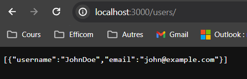

# halil-can-mathis-conception-validation
 
L’objectif de ce TP est de construire une application pas à pas, en la testant au fur et à mesure. 

On cherche avant tout à pratiquer, en commençant par des choses simples, et en introduisant les notions les plus compliquées juste quand on en aura besoin. 

Ce TP s’effectue en binôme obligatoirement ! Pourquoi ? Parce que dans la vraie vie, on est très souvent amené à collaborer à plusieurs derrière le clavier. Mieux vaut s’y préparer !

Faire un nouvel endpoint qui permet cette fois-ci d’ajouter un utilisateur dans notre tableau en mémoire :
curl -X POST -H "Content-Type: application/json" -d "{\"username\": \"JohnDoe\", \"email\": \"john@example.com\"}" http://localhost:3000/users/add

Vérifier manuellement que votre endpoint fonctionne, en insérant un utilisateur puis, successivement, en faisant un GET pour vérifier que tout fonctionne :
Voici la commande corrigée pour ajouter l'utilisateur "Alice":
curl -X POST -H "Content-Type: application/json" -d "{\"username\": \"Alice\", \"email\": \"alice@example.com\"}" http://localhost:3000/users/add

Et voici la commande pour ajouter l'utilisateur "JohnDoe":
curl -X POST -H "Content-Type: application/json" -d "{\"username\": \"JohnDoe\", \"email\": \"john@example.com\"}" http://localhost:3000/users/add

curl http://localhost:3000/users

Essayez d’insérer le chiffre 5 dans votre tableau. Que se passe-t-il ? Est-ce un problème ?
Le problème qu'on peut rencontrer en essayant d'insérer le chiffre 5 dans le tableau est lié au fait qu'on stocke des objets d'utilisateur dans le tableau, mais le chiffre 5 est un nombre.

Où on s'est arrété :
slide : Conception : amélioration du code